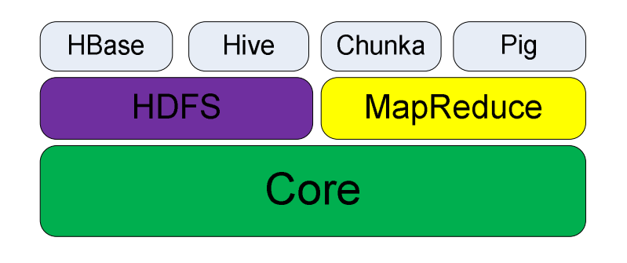
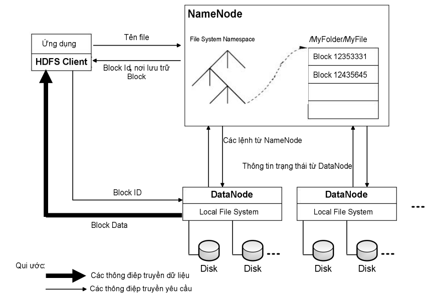

# I. Giới thiệu về Hadoop

## 1\. Hadoop là gì?

_Apache Hadoop_ là một framework dùng để chạy và xử lý tính toán những dữ liệu lớn trên nhiều máy tính. Hadoop sử dụng mô hình **_Map/Reduce_**, đây là mô hình mà ứng dụng sẽ được chia nhỏ ra thành nhiều phân đoạn khác nhau, và các phần này sẽ được chạy song song trên nhiều node khác nhau.

## 2\. Thành phần của Hadoop

- `HDFS`: Nếu bạn muốn có hơn 4000 máy tính làm việc với dữ liệu của bạn, thì bạn phải có dữ liệu của bạn trên hơn 4000 máy tính đó. HDFS thực hiện điều này cho bạn. HDFS có một vài bộ phận dịch chuyển. Các Datanode (Nút dữ liệu) lưu trữ dữ liệu của bạn và Namenode (Nút tên) theo dõi nơi lưu trữ.
- `MapReduce`: Đây là mô hình lập trình cho Hadoop. Có hai giai đoạn, đó là Map và Reduce. Cụ thể đó là có một quá trình shuffle-sort (ND.: một quá trình mà hệ thống thực hiện sắp xếp và chuyển các kết quả đầu ra của map tới các đầu vào của các bộ rút gọn) giữa hai giai đoạn Map và Reduce. JobTracker (Trình theo dõi công việc) quản lý hơn 4000 thành phần công việc MapReduce.
- `Hadoop Streaming`: Một tiện ích để tạo nên mã MapReduce bằng bất kỳ ngôn ngữ nào: C, Perl, Python, C++, Bash, v.v. Các ví dụ bao gồm một trình mapper Python và một trình reducer AWK.
- `Hive và Hue`: Đây là công cụ có thể viết SQL và yêu cầu Hive chuyển đổi nó thành một tác vụ MapReduce. Hue cung cấp một giao diện đồ họa dựa trên trình duyệt để làm công việc Hive của bạn.
- `Pig`: Một môi trường lập trình mức cao hơn để viết mã MapReduce. Ngôn ngữ Pig được gọi là Pig Latin
- `Sqoop`: Cung cấp việc truyền dữ liệu hai chiều giữa Hadoop và cơ sở dữ liệu quan hệ truyền thống(TSQL).
- `Oozie`: Quản lý luồng công việc Hadoop. Oozie cung cấp cấu trúc phân nhánh if-then-else và điều khiển trong phạm vi tác vụ Hadoop của bạn.
- `HBase`: Một kho lưu trữ key-value có thể mở rộng quy mô rất lớn. Nó hoạt động rất giống như một hash-map để lưu trữ lâu bền (nó như một từ điển trong Python). Nó không phải là một cơ sở dữ liệu quan hệ, mặc dù có tên là HBase.
- `FlumeNG`: Trình nạp thời gian thực để tạo luồng dữ liệu vào Hadoop. Nó lưu trữ dữ liệu trong HDFS và HBase
- `Mahout`: Máy học dành cho Hadoop. Được sử dụng cho các phân tích dự báo và phân tích nâng cao khác.
- `Fuse`: Làm cho hệ thống HDFS trông như một hệ thống tệp thông thường, do đó bạn có thể sử dụng lệnh ls, cd, rm và những lệnh khác với dữ liệu HDFS.
- `Zookeeper`: Được sử dụng để quản lý đồng bộ cho hệ thống. nó giúp ta quản lý công việc một cách dễ dàng

>  Cấu trúc căn bản của Hadoop

# II. Hadoop Distributed File System (HDFS)

## 1\. Giới thiệu về HDFS

Khi dung lượng của tập dữ liệu vượt quá khả năng lưu trữ của một máy tính, tất yếu sẽ dẫn đến nhu cầu phân tán dữ liệu lên trên nhiều máy tính khác nhau. Hệ thống quản lý dữ liệu cho việc lưu trữ dữ liệu trên một cụm nhiều máy tính gọi là hệ thống phân tán dữ liệu. Do hoạt động trên môi trường mạng, nên các hệ hống phân tán dữ liệu phức tạp hơn rất nhiều so với một hệ thống file cục bộ (xử lý trên một máy tính).

> Ví dụ như một hệ hống phân tán dữ liệu phải quản lý được tình trạng hoạt động (live/dead) của các server tham gia vào hệ thống.

Ta có thể sử dụng Hadoop nó hỗ trợ cho chúng ta một Hệ thống phân tán dữ liệu gọi là `HDFS` (viết tắt từ _Hadoop Distributed File System_) là một nền tảng lưu trữ dữ liệu lớn và chi phí rẻ.

## 2\. Kiến trúc HDFS

Giống như các hệ thống file khác, `HDFS` duy trì một cấu trúc cây phân cấp các file, thư mục mà các file sẽ đóng vai trò là các node. Trong `HDFS`, mỗi file sẽ được chia ra làm một hay nhiều block và mỗi block này sẽ có một block ID để nhận diện. Các block của cùng một file (trừ block cuối cùng) sẽ có cùng kích thước và kích thước này được gọi là `block size` của file đó. Mỗi block của file sẽ được lưu trữ thành ra nhiều bản sao (**replica**) khác nhau vì mục đích an toàn dữ liệu

>  Kiến trúc tổng quan của HDFS

- `HDFS` có một kiến trúc **_master_**/**_slave_**, trên một cluster chạy HDFS, có hai loại node là Namenode và Datanode. Một cluster có duy nhất một Namenode và có một hay nhiều Datanode.

- `Namenode` đóng vai trò là **master**, chịu trách nhiệm duy trì thông tin về cấu trúc cây phân cấp các file, thư mục của hệ thống file và các **metadata** khác của hệ thống file.
